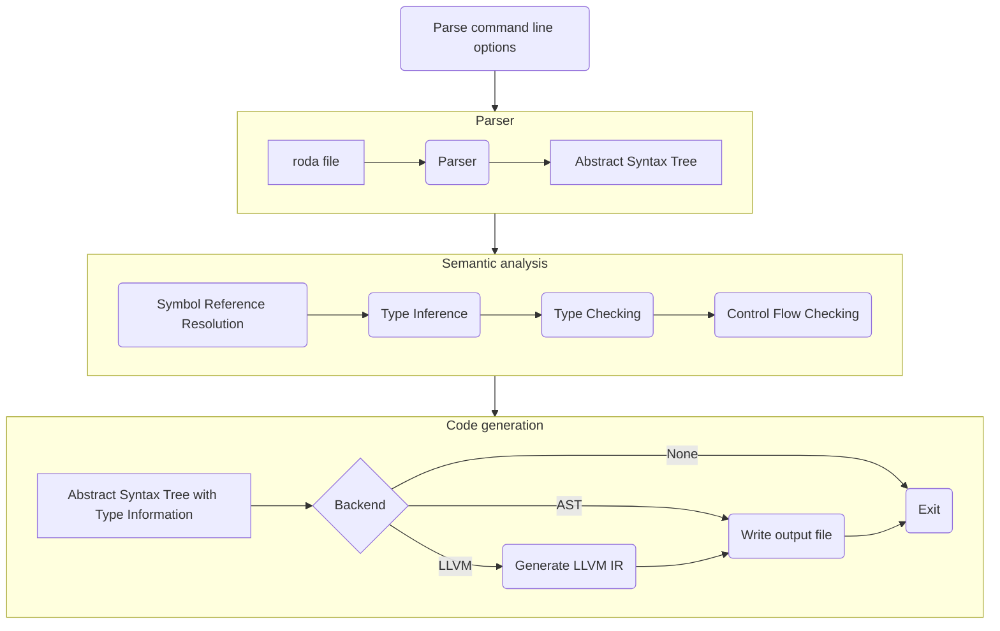

roda Compiler
=============

## General

Roda is a small, strongly typed, compiled programming language than uses a modern syntax.

The roda language contains the following features:
* Functions (with support for calling variadic functions)
* Conditionals using if-else expressions
* While-loops
* Pointers
* Arithmetic expressions on integers and floating point numbers
* Binary operations on integers
* Boolean expressions
* Arrays
* Structs
* Basic type inference
* Type aliases

The compiler also tries to give useful and informative error messages.

## Language

The following is a simple hello-world program written in roda:
```rust
extern fn printf(fmt: *u8, ..);

pub fn main(): int {
    printf("Hello world!\n");
    return 0;
}
```

The following example shows the supported control structures and their usage:
```rust
extern fn printf(fmt: *u8, ..);

pub fn main(): int {
    let i = 1;
    while i <= 100 {
        if i % 3 == 0 && i % 5 == 0 {
            printf("FizzBuzz\n");
        } else if i % 3 == 0 {
            printf("Fizz\n");
        } else if i % 5 == 0 {
            printf("Buzz\n");
        } else {
            printf("%li\n", i);
        }
        i += 1;
    }
    return 0;
}
```

The rest of the features can be used in the following way:
* Arithmetic expressions: 
    ```rust
    let x  = 1 + 2;         // x = 3
    x += 5;                 // x = 8
    // x += 0.5;            // this is not allowed, since real literals can not be implicitly converted to integers
    let y: f64 = 0.5 + 0.1; // y = 0.6
    // y += 5;              // this is not allowed, since integer literals can not be implicitly converted to floats
    ```
* Pointers:
    ```rust
    let a = *b; // take the address of b and store it into a
    let c = &a; // dereference a to store its value into c
    &a = c;     // assign the value in c to the address pointed to by a
    ```
* Arrays:
    ```rust
    let a: [3]int; // create an array of 3 ints
    a[0] = 1;      // assign the value 1 to the first element of a
    a[1] = 2;      // assign the value 2 to the second element of a
    a[2] = a[1];   // assign the value in the second element of a to the third element of a
    ```
* Structs:
    ```rust
    let a: (a: int, b: f64);
    a.a = 1;
    a.b = 2;
    a = (a = 5, b = 5.5);
    ```
* Basic type inference:
    ```rust
    let a = 1;        // a is an integer
    let b = 2.0;      // b is a floating point number
    let c = "Hello";  // c is a string
    let d = true;     // d is a boolean value
    let e = 'a';      // e is a character
    let f;
    a += f;           // f is also an integer
    ```
* Type aliases:
    ```rust
    type MyInt = int;  // create a type alias for int
    let a: MyInt = 1;  // a is an integer
    ```

## Implementation


We have chosen a multi-pass compiler architecture, operating primarily on an abstract syntax tree.
The following are the main steps that make up the compilation process:
* **Parser:**

    In this phase, the compiler reads in the contents of a file and parses it into an abstract
    syntax tree using a lexer defined with [Flex](https://github.com/westes/flex) and a parser
    generated with [Bison](https://www.gnu.org/software/bison/).

* **Symbol Reference resolution:**

    In this phase, the compiler resolves all references to symbols for both variables and types in
    the abstract syntax tree. This step also generates and uses the symbol tables, creating a symbol
    entry for each of the defined types, functions, and variable. The symbol table is implemented as
    a tree linked only with parent-pointers. Each element of the tree represents a separate scope which is
    implemented using hash tables. Symbol lookup starts at a node and traverses up to the root,
    until the symbol is found. Types and symbols share the same hash table, but are handled
    differently.

* **Type Inference:** 

    In this phase, the compiler infers the types of all variables and expressions in the abstract
    syntax tree. This phase first evaluates all the explicitly given type annotations and implicit
    type constraints (e.g., conditions in if statements), and then tries to infer all other types.
    Type inference is implemented by propagating the types using graph traversal. The compiler will
    also, if the type can not otherwise be determined, assume the type of integer and real literals.
    Type conflicts may be identified and reported during this phase.

* **Type Checking:**

    In this phase, the compiler checks that all types in the abstract syntax tree are correct. This
    includes for example checks about only using numeric types in addition or multiplication, or
    testing that the correct number of arguments is passed to a function call. Also, this step makes
    sure that the type of each variable and expression has been successfully inferred.
    After this phase completes successfully, the abstract syntax tree has been populated with valid
    types.

* **Control Flow Checking:**

    In this phase, the compiler checks that all functions that are expected to return a value,
    actually do so in every possible path through the control flow graph. After this phase, the
    abstract syntax tree is guaranteed to represent a valid program, that can be used by the code
    generation.

* **Code generation:**

    In this phase, the compiler generates code for the abstract syntax tree. This phase can always
    do nothing or write the abstract syntax tree to a file. It can also, if compiled with support
    for it, generate [LLVM](https://llvm.org/) IR and use it to generate an assembly or object
    file. Optionally this phase might also include an invocation of the system's c compiler to link
    the program.

## Development

### Requirements

To compile this project, you will need [GNU Make](https://www.gnu.org/software/make/) and a C
compiler. This project has only been tested on Linux using GCC or Clang and a [GNU C Library](https://www.gnu.org/software/libc/).
Other requirements include relatively recent versions of [Flex](https://github.com/westes/flex) and
[Bison](https://www.gnu.org/software/bison/). If you want to compile this project with support for
code generation, you will need [LLVM](https://llvm.org/) 10 or later installed.

### Building

To compile this project from source first clone it, and then run the `make` command. After building
the project successfully, the binary can be found at `build/$(BUILD)/bin/rodac`.

```sh
git clone https://github.com/rolandbernard/roda
cd roda
make BUILD=release
```

There are the following interesting options that can be passed to the `make` command:
* `BUILD` should be one of `debug` (default), `release`, `gdb`, or `profile`.
* `LLVM` is by default set automatically, but can be set manually to either `yes` or `no` depending
on whether you want to compile with the LLVM backend or not.

### Testing

To run the tests in the `tests` directory we use a project that can be found at https://github.com/rolandbernard/tested.
You would need to have the `tested` binary in your `PATH` variable and the run the `test` target of
the Makefile. The `test` target has the `build` target as a dependency, so it will first build the compiler.

```sh
make test
```

### File structure

There are two main directories in this project:
* `src` contains the source for the compiler, with the entry point in `src/rodac/main.c`.
* `tests` contains a number of test files. You can look at these for examples.
    * `tests/errors` all files in this directory are expected to produce errors during the compilation.

